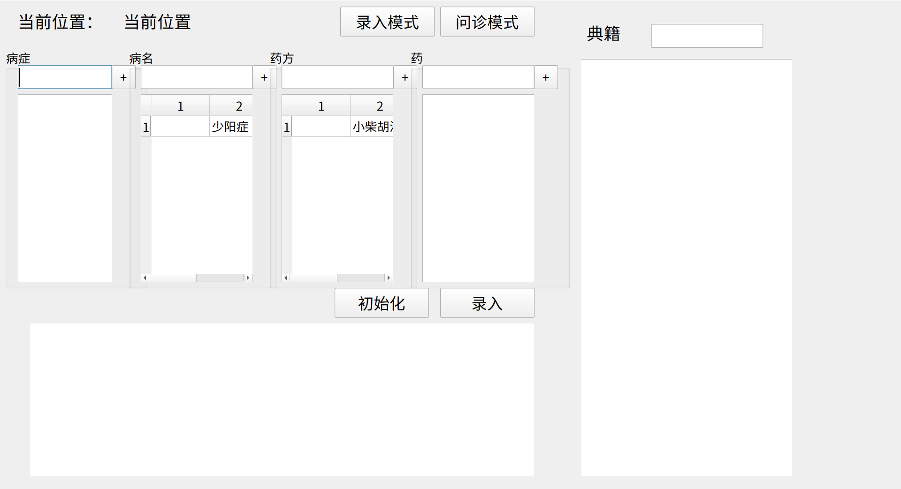

# 中医智能检索系统 TCM-Retrieval-System

[TOC]

## 简介

​	中医智能检索系统是一款辅助中医医生开药方的桌面软件，包含录入和检索症状、病症、药方、药材的功能，也具备文献检索功能。	

## 文档

- [使用说明](Document/Usage.md)
- [开发文档](Document/Dev.md)
- [接口文档](Document/API.md)
- [录入模式UML图](Document/录入活动图.pdf)
- [问诊模式UML图](Document/问诊活动图.pdf)

## 界面设计

## 开发进程

### UI界面

- [ ] 修改下拉框的命名方式，同时修改代码中相关的变量
- [ ] 在检索模式下，隐藏+号
- [ ] 在录入模式下，应有编辑和删除按钮
- [ ] 去掉其他三个的表头
- [ ] 模式选择按钮貌似改成RadioButton这样的多选框比较好？
- [ ] 在开方工作区下添加清空和保存按钮
- [ ] 另外可以考虑加个标题
- [ ] 录入药需要选择属性

### Control类

- [ ] 完善相关功能

### Front类

- [ ] set_table函数应该只显示一列
- [ ] 添加成功后最好可以弹框提示
- [ ] 完善相关功能

### Back类

- [ ] 完善相关功能

### 数据库

- [ ] 修改medicine表结构，添加属性
- [ ] 新建药方表

------

Collaborators: [Alanlinzy](https://github.com/alanlinzy), [Brahamack](https://github.com/brahamack), [Defjia](https://github.com/DefJia)